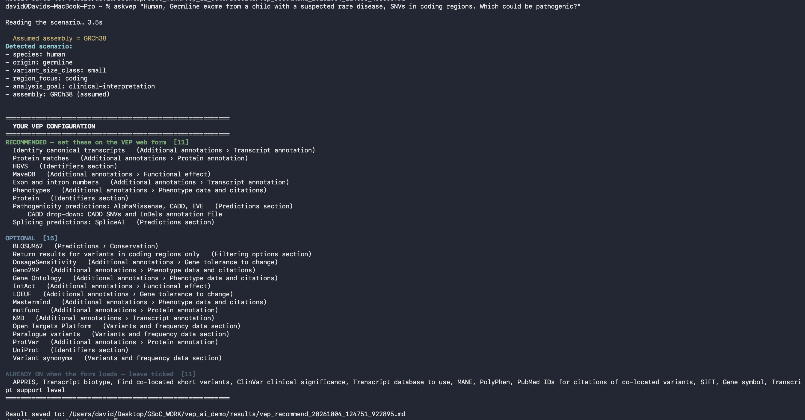
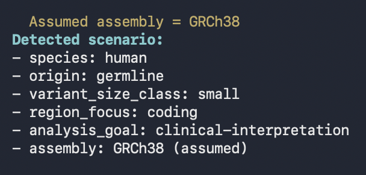
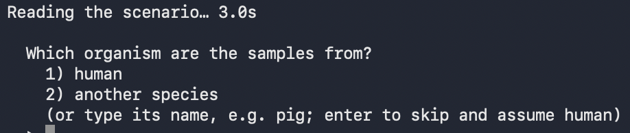
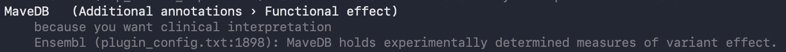
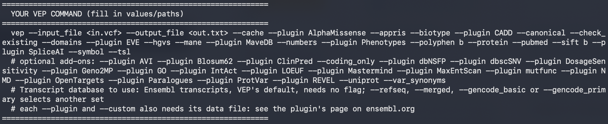
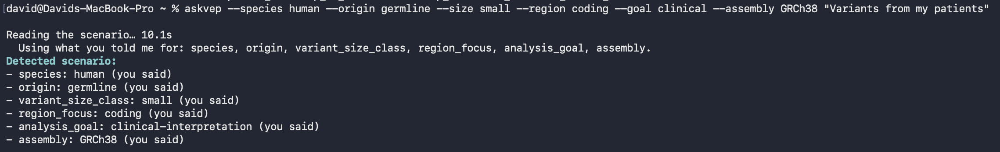

# askVEPai: trained chatbot interface for Ensembl VEP web

**Google Summer of Code 2026 · final report**

| Contributor | David Gao ([Uninterpretable-Evolving-Blackbox](https://github.com/Uninterpretable-Evolving-Blackbox)) |
|---|---|
| Organisation | Genome Assembly and Annotation (EMBL-EBI, Ensembl) |
| Mentors | Likhitha (mentor), Aine (co-mentor), Nakib (co-mentor) |
| Project size | Medium |
| Proposal | askVEPai: AI chatbot interface for Ensembl VEP web |
| Code | [github.com/Uninterpretable-Evolving-Blackbox/askVEPai](https://github.com/Uninterpretable-Evolving-Blackbox/askVEPai) |

Ensembl VEP web form offers dozens of configuration options for variant annotation, which can overwhelm new users. askVEPai reads whatever the user types in for a variant-analysis job and returns RECOMMENDED options and OPTIONAL options.

We want the experience to be as smooth as possible, but when something is unclear and user can potentially miss out key information in output, user is asked to make a simple decision so we can classify their scenario. Optionally user can also receive reasoning behind why certain options were recommended.

It runs on a local, open-source LLM, `gemma4:26b`, so data can stay local. In a comparison on 20 scenarios it recommended far more of the reference options than commercial LLMs, Claude Opus 5.5 (medium) included (§4).

How to install and run it: [`README.md`](README.md). Every measurement: [`evidence/current_evidence/README.md`](evidence/current_evidence/README.md).

**Central lesson learnt:** "Simplicity is prerequisite for reliability." (Edsger W. Dijkstra, 1975)

The design began with retrieval-augmented generation, embedding-based semantic retrieval and two model calls. LLM is all the hype, but as the project went on, the role of LLM was reconsidered, and the simpler, more deterministic design was often better and more reliable.

## 1. What askVEPai does

At a high level: a user describes the analysis in their own words, and askVEPai provides recommended and optional options to tick on web form.

Example interaction (CLI, as web integration is handled by EBI):



- Facts the scenario not picked up by LLM are assumed and stated (here the genome build):

  

- or asked for when no assumption will leave all RECOMMENDED untouched:

  

- `--explain` adds the reason for every option: the factor value that raised it, from the project's priority table, and Ensembl's own description of the option from the release-116 [options](https://www.ensembl.org/info/docs/tools/vep/script/vep_options.html) and [plugins](https://www.ensembl.org/info/docs/tools/vep/script/vep_plugins.html) pages. E.g. under each option explanation in grey:

  

- `--cli` prints the configuration as a VEP command instead of the form lists, using the flags from Ensembl's options page and plugin configuration, with the optional add-ons as a comment.

  

You can also specify the factor values explicitly yourself using `--species`, `--origin`, `--size`, `--region`, `--goal` and `--assembly`, or name the organism with `--organism`. A stated value overrides the model's reading:



## 2. How it works

```
scenario (prose) ──► one model call ──► 5 factor values ──► priority table + checker ──► RECOMMENDED / OPTIONAL / ALREADY ON
                     (gemma4:26b,         + organism          (deterministic code)        + why each option
                      local, Ollama)
```

- **One model call.** The model's only job is to read the scenario. The same call decides whether the message asks for a VEP configuration at all; anything else gets a short note instead.

- **Five factors.** Every scenario is described by five facts: species (human/non-human), origin (germline/somatic), variant size (small/structural/both), region (coding/regulatory/both) and analysis goal (basic consequences/clinical interpretation/population frequency). The model also reads the organism's name, if one is given, for species-specific options.

- **The organism** is looked up in Ensembl's own species list (754 names, including breeds, aliases and abbreviations), so the model cannot invent a species.

- **Missing facts.** A fact the text leaves out is asked for when its answer would change the RECOMMENDED options (the species and the analysis goal). Otherwise it takes a fallback chosen by what a wrong guess would cost, and the tool says what it assumed.

- **The priority table** ([`vep_ai_demo/priority_by_factor.json`](vep_ai_demo/priority_by_factor.json)) gives, for each option and each factor value, recommended, optional or not_applicable. It was written for this project and corrected with the mentors, and will keep being updated.

- **The checker** removes what the organism or the genome build cannot use, going by Ensembl's own lists; recommends missing prerequisites; resolves conflicts between options; and never recommends an option that deletes rows from the results. An extra annotation only adds a column the user can ignore, but a filter that drops rows can hide the variant the user is looking for.

- **Three lists.** RECOMMENDED (tick these), OPTIONAL (add-ons worth considering) and ALREADY ON (the form ticks them by default, so they are never listed as something to set). A dataset with both short and structural variants gets two configurations, one per VEP run, since the form's CADD file must be chosen per size.

- **What the form cannot do**, such as restricting to a gene list or to loss-of-function variants, is said plainly, with how to filter the results page instead.

The configuration is built deterministically, so the same five factors always give the same configuration, and every option traces to the factor value that raised it. The full description is in [`README.md`](README.md).

## 3. From the proposal: what had been delivered

The core problem we aimed to resolve, as stated in the proposal, was that the VEP web interface "exposes an extensive configuration surface that overwhelms new users." The project brief asked for three things: label the web form's options, assemble training data, and build a prototype model. Three requirements were confirmed with the mentors before the start: the model is open source and runs locally, the first data are constructed gold examples, and a VEP output explainer is a welcome extension.

| deliverable in the proposal | two-pass design (to 14 September) | current tool |
|---|---|---|
| Knowledge base of ~55 options, each mapped to its web-form section | 58 options by June, taken from the web-form code and Ensembl's pages (my pre-GSoC demo had 26) | 70 options, taken from the same sources. Each option records the Ensembl source of every fact ([`reference/README.md`](reference/README.md)) |
| 15–20 gold-standard examples with an 80/20 train/test split | 20 worked examples (23 by the end) written with Claude to test retrieval methods and model sizes. Used both in the prompt and, one held out at a time, as the test set. From July, 31 scenarios generated by gemma4:26b from the factor space, systematically and reviewed by the mentors | The same 31 scenarios, after two rounds of mentor review, plus three test sets: 150 tricky cases, 754 organism names, 78 scenarios with one fact removed. Nothing is trained, so there is no split |
| RAG pipeline returning structured recommendations for any VEP query via Ollama | Built: worked examples in the prompt, the model drafts a configuration, the checker corrects it. F1 0.880 once the five factors were added (Exp 17) | One model call reads the five factors; the priority table and checker build the configuration. The checker had been rebuilding the draft's RECOMMENDED options on every scenario. On the same test, one call scores F1 0.898 against 0.870 for two, in 1.2 s against 17.9 s ([D3](evidence/legacy_decisions/README.md)) |
| Semantic retrieval benchmarked against keyword baseline on expanded KB | Benchmarked: showing every example beat both retrieval methods, F1 0.86 against 0.73 for keyword and 0.38 for semantic retrieval (Exp 2) | No retrieval; it survives only on the legacy `--two-pass` path |
| Constraint checker with 100% species-violation detection | Built: the model wrote a list of options and the checker corrected it. It knew only human or non-human, so it deleted human-only options (for example ClinVar) from any non-human request. It also dropped one of any two options that cannot be used together, and added any option another depends on | The checker builds the list itself from the priority table, then checks each option against the organism the user named, using Ensembl's per-species lists (for example, SIFT exists for 13 species). It still resolves conflicts and adds prerequisites. Tested on all 358 non-human species in Ensembl's index with every kind of scenario: no option was ever shown to a species Ensembl does not list it for |
| Evaluation report with N≥3 runs, mean ± SD, across at least two model sizes | Measuring the system: the configuration the model wrote was scored against the gold examples (enable-F1), each run 3–5 times and reported as mean ± SD, across 24 experiments in the project's ledger. Choosing the model: five models compared (Exp 1), then three Gemma 4 sizes (Exp 10, five runs; Exp 19, three runs); gemma4:26b chosen ([D1](evidence/legacy_decisions/README.md)) | Measuring the system: five experiments on the model's one job, reading the scenario, each with reasoning on and off and each repeated ([`evidence/current_evidence/README.md`](evidence/current_evidence/README.md)). At temperature 0 the seed changes nothing, so repeats measure run-to-run drift and are reported as a range. Choosing the model: the three Gemma 4 sizes re-checked on the one-call design, on the 31 review scenarios. Same RECOMMENDED options as from the agreed factors: gemma4:26b 30/31, gemma4:e4b 27/31, gemma4:e2b 25/31; all five factors right: 24/31, 20/31, 18/31. gemma4:26b kept |
| Web-form JSON schema for "click to apply" | Web form integration left to EBI team, as they are updating system. | Same. |
| End-to-end demo | Command line | Same |
| README, setup guide, knowledge-base contribution guide | A progress log and reading order for the mentors | [`README.md`](README.md), [`vep_ai_demo/README.md`](vep_ai_demo/README.md) (every flag and environment variable), [`reference/README.md`](reference/README.md) (sources), and [§8](#8-how-to-extend) |
| Extended: QLoRA fine-tuning | Not needed | The same: the model's only job is reading five factors, which it does without training |
| Extended: FastAPI endpoint | Again, EBI team shifting to new system, left for them. | Same |
| Extended: VEP output explainer | `explain-result`, from my pre-GSoC demo | Removed: the tool's job is the configuration, and `--explain` already explains each recommended option for the scenario |
| Extended: attribution testing | Done (Exp 5–6): removing one part of the knowledge base and re-running. Removing the worked examples removed 71% of the recommendations; the option descriptions, 2%; the priority labels, 0% | Not needed: the model never names an option, so every recommendation traces to a row of the priority table. |

## 4. Evaluation and Results

Everything after the model call is deterministic (§2), so the same five factor values always give the same configuration. The evaluation therefore tests the model's one job, reading the scenario. It asks two things: does the model read the five factors right, and when it misreads one, does the configuration the user sees change? Whether the priority table recommends the right options is a separate question, settled by the mentors' review (§6).

- **150 tricky** cases are built to make the model misread. Each of the five factors gets five kinds of misleading wording, with six cases each (5 × 5 × 6 = 150): a negated cue ("not a mouse study"), a word used in another sense ("clinical precision"), a tool name ("we keep COSMIC open"), a cue about something other than this data ("controls recruited through a cancer registry"), and a fact that needs biology to read ("man's best friend"). Each case is asked four ways: stated plainly; with the misleading cue, where the answer should not move; the same sentence without the trick, where the answer should change; and with the fact removed, where the model should report it unstated. A case counts as right only if all four versions are.

- **31 review** scenarios are the scenarios from §3. The 31 were sampled from the factor space so that every factor value appears in about 15 scenarios (code picks the factor values; `gemma4:26b` writes only the wording), then reviewed and corrected by the mentors. They are plainly worded, so they test the ordinary case: does the user get the configuration the true factors give? (Originally intended to make a generation pipeline to produce extra scenarios for RAG in case of future updates. Now ended up being a reference set to adjust system on as RAG is no longer in use).

- **754 organism** names are every name in Ensembl's species list (§2), each in a sentence. They are then asked again with a second organism the data is not from ("grown on mouse feeder cells").

- **78 missing** facts test the fallbacks in §2. Each of the 31 scenarios was rewritten with one fact removed (origin, variant size, region or analysis goal), and 78 rewrites kept the other four intact. The tool must state the value it assumed, or ask. A rewrite fails when the model fills the fact in itself, because the user is then neither asked nor told.

All figures: `gemma4:26b` through Ollama on an Apple M5 Max, temperature 0. The question behind each, how it is scored, where it fails and the file it comes from are in [`evidence/current_evidence/README.md`](evidence/current_evidence/README.md).

| experiment | reasoning on (the default) | reasoning off |
|---|---|---|
| 150 tricky cases: all four versions of a case read right | 145/150 (repeats 143, 146) | 137/150 (repeats 137, 137) |
| …of which the misreads leave the RECOMMENDED options unchanged | 149/150 (repeats 148, 149) | 145/150 (repeats 145, 145) |
| 31 review scenarios: same RECOMMENDED options as from the true factors | 30/31 (repeats 30, 30) | 29/31 (repeats 29, 29) |
| Organism named right, over 754 names from Ensembl's species list (scientific, common, breeds) | 746/754 (repeats 747, 746) | 746/754 (repeats 746, 746) |
| …when the text also mentions a second organism the data is not from | 749/754 (repeats 750, 749) | 745/754 (repeats 744, 743) |
| Scenarios with one fact left out: the tool uses its default for it and tells the user (78 rewrites of the review scenarios) | 73/78 (repeats 72, 72) | 72/78 (repeats 72, 72) |

The 31-scenario figures score the tool against its own priority table: they measure how far a misread moves the output, not whether the table is right. The external check is agreement with the mentor's own edits to round 1 of the review: F1 0.759.

### Compared with general chat models

We gave commercial chat models the same instruction and 20 scenarios, and compared their recommendations with the priority table's:

| model | table's options recommended (of 106) | options that cannot work | filters that delete results |
|---|---|---|---|
| **askVEPai** (`gemma4:26b`, local) | 95 | 0 | 0 |
| Claude Opus 5.5, given Ensembl's VEP documentation | 53 | 2 | 2 |
| Claude Opus 5.5 | 38 | 5 | 11 |
| ChatGPT 5.6 Luna (website, Thinking on) | 17 | 11 | 3 |

Surpassingly ‘smarter’ models and the documentation help, but even the best recommends about half the table's options, and some that cannot work for the species or variant type. The first column is scored against our own table (§6); the other two rest on Ensembl's lists. Full results, with three more arms, are in experiment 6 of [`evidence/current_evidence/README.md`](evidence/current_evidence/README.md#6--chat-models-20-cases).

## 5. Upstream

A summary of the project will go to EMBL-EBI's GSoC projects repository, [EMBLEBI_Projects](https://github.com/EMBLEBIGSOC/EMBLEBI_Projects), by pull request. It describes what was built and points to the code in this repository. The mentors plan to integrate askVEPai into the VEP web interface once Ensembl has finished redesigning it. Until then askVEPai runs as a standalone command-line tool.

## 6. Limitations

- **Circular option evaluations:** Very little desk queries exist. Priority table is updated throughout to be as ground truth as possible under supervision of mentor. so of course our system does well. Encouraging pattern is that supposingly smarter commercial LLM agree with it more: askVEPai > Opus 5.5 (medium) + docs > Opus 4.7 (medium) + docs > Opus 5.5 (medium) > Sonnet 5 (medium) + docs > ChatGPT 5.6 Luna (thinking toggled on for website) > Sonnet 5 (medium).

- **The test cases are synthetic.** The 150 tricky cases and the 31 review scenarios were generated by AI, systematically and grounded in the literature: the tricky cases mimic published test designs (CheckList, contrast sets, unanswerable questions) and known pitfalls in reading biomedical text (negation, word sense, ambiguous names), and the review scenarios were sampled evenly across the factor space. No set of real user questions with confirmed answers exists yet. The chat-model comparison is scored against the priority table.

- **Some organism names are deliberately not resolved.** Common and scientific names, Ensembl's aliases ("swine"), abbreviated scientific names ("S. scrofa"), and yeast, worm and fly all resolve. Names that could mean two species ("C. lupus": dog or dingo) are left unresolved on purpose, and organisms outside the VEP web form (Arabidopsis, which is in Ensembl Plants) are not recognised.

- **An unstated goal is sometimes filled in.** With reasoning on, the model occasionally picks up basic-consequence for a query that states no goal ("Show me variants affecting BRCA1, BRCA2"), so the tool neither asks nor prints that it assumed one. No practical difference, because the configuration is the same as the fallback it would otherwise use; the user only loses the notice.

- **Repeated runs can differ.** At temperature 0 the 150 tricky cases scored 145, 143 and 146 on three runs with reasoning on, and 137 on all three with reasoning off. This is suggestive of borderline cases.

- **Genes and consequence classes cannot be set on the input form.** The tool prints how to filter the results page instead.

- **Command line only.** No JSON output, no API.

- **Hardware.** `gemma4:26b` needs more than about 20 GB of free memory (`gemma4:e4b` fits in less, and reads the factors less well). A configuration takes about 5 s with reasoning on, about 1 s with it off.

## 7. What is left

- **Priority table:** the mentors think it looks good so far; it stays under review as the tool is used and VEP is updated.

- **Catalogue citations:** 65 of the 70 options still cite the release-115 copies of the form files; their facts were checked against the release-116 form, so only the citations need moving.

- **An unstated goal filled in:** with reasoning on, the model sometimes reads a query with no goal as basic consequences. This changes nothing in the configuration, since basic consequences is the fallback anyway; the user only misses the line saying it was assumed.

## 8. How to extend

Everything the tool knows is in six files in [`vep_ai_demo/`](vep_ai_demo/). The code reads them at start-up. Environment variables point the tool at another copy of the first three (listed in [`vep_ai_demo/README.md`](vep_ai_demo/README.md)).

| file | holds |
|---|---|
| `vep_options.json` | the options: what each is, where it sits on the form, who can use it |
| `priority_by_factor.json` | for each option and each factor value: recommended, optional or not_applicable |
| `factors.json` | the five factors and their values |
| `species_index.json` | Ensembl's species names, and which genomes count as one species |
| `hgnc_symbols.json` | human gene symbols, so the tool can tell a gene list it cannot set on the form |
| `ensembl_docs/` | Ensembl's options and plugins pages, parsed, which `--explain` quotes |

### Add or correct an option

Add an entry to `vep_options.json`:

| field | value |
|---|---|
| `id`, `name` | our identifier; the label the form shows |
| `cli_flag` | the VEP command-line equivalent |
| `web_form_section`, `web_form_subsection` | where it sits: `input`, `identifiers`, `variants_frequency_data`, `additional_annotations`, `predictions`, `filters` or `advanced` |
| `web_default_on`, `web_default_value` | whether the form ships it ticked, and with what value |
| `species` | Ensembl production names (`sus_scrofa`), or `"all"` if every species has it |
| `assemblies` | the builds that have its data, or `null` for both |
| `depends_on`, `conflicts_with` | other option ids |
| `description` | Ensembl's own words, from the options or form page |
| `provenance` | for each field, the file and line in `reference/` it came from |

Then give it a row in `priority_by_factor.json` in the same change. An option with no row is never shown.

### Change a recommendation

A row in `priority_by_factor.json` lists, for each factor value that concerns the option, one of three labels:

```json
"af_gnomade": {
  "analysis_goal":      { "population-frequency": "recommended" },
  "variant_size_class": { "structural-CNV": "not_applicable" }
}
```

The engine applies two rules:

1. **Removal.** Species, origin, variant size and region can remove an option. A factor removes it only when every value the scenario has for that factor says `not_applicable`, so a coding-and-regulatory scenario keeps its missense predictors.
2. **Ranking.** Otherwise the strongest label across all the scenario's values wins. `recommended` puts the option in RECOMMENDED; `optional` makes it an add-on; no label leaves it out.

A joint condition ("clinical and structural together raise X") cannot be written one value at a time. It goes in `conditional_rules` in `factors.json`, which can only raise an option, never lower it (there are none today). The checker (§2) then removes what the organism or the genome build cannot use.

Run any scenario with `--explain` to see which factor value raised each option.

### Add a factor value

Add it to `factors.json`. The classifier's instructions list the allowed values from that file, so the model can answer with the new value straight away. Give the value a one-line definition beside the others in the classifier prompt in `vep_assistant.py`; without one, the model has only its name to go on. Then add the new value to the rows of `priority_by_factor.json` it should affect.

### Swap the model

Set `VEP_MODEL` to any model Ollama serves (`OLLAMA_BASE_URL` points at another Ollama server). Measure it before relying on it:

```bash
python3 evidence/current_evidence/factors_150_tricky_cases.py --model <model>
python3 evidence/current_evidence/organism_754_names.py --model <model>
```

### Measure a change

Re-run the experiments in `evidence/current_evidence/` with `--json <file>` and compare the new file with the published one in `results/`. Where a script offers `--limit N`, it runs the first N cases only, for a quick check.

### Follow a new Ensembl release

The sources, with their URLs and dates, are listed in [`reference/ensembl_source/README_sources.md`](reference/ensembl_source/README_sources.md) and [`reference/ensembl_docs_116/README.md`](reference/ensembl_docs_116/README.md). Fetch the new release's copies, diff them against these, and update the options whose facts moved, with their provenance. Also refresh `species_index.json` from Ensembl's REST `/info/species`, and `ensembl_docs/` from the new options and plugins pages.

## 9. Challenges/What I learned

My earlier work in bioinformatics and machine learning consisted mainly of research: statistically analysing datasets, training and evaluating models. askVEPai had a different aim, which was to be useful to real users. That changed where the effort went.

**Ease of use.** Much of the work went into removing friction, increasing speed of response and cleaning outputs.

**Decisions outside the model.** The priority table and the default fallbacks took as much care as the system design and arguably matter more. They decide what the user sees, and the fallbacks were designed to lose as little information as possible when a fact is missing.

**A smaller role for the LLM.** The first design used two model calls, a long system prompt and retrieval (RAG). It was slower and less accurate than the current single call. The model's job is now to read the user's scenario, written in messy natural language, which is what LLMs do best. Everything after that is deterministic code (the priority table, gates and checker), which made the tool both more accurate and faster. It needed no fine-tuning and no further fancy ML techniques. A multi-call RAG pipeline with fine-tuning would look more impressive on a CV, but it would not have improved the tool and would be harder to maintain.

## 10. Acknowledgements

Thanks to the EBI team, and particularly to mentor Likhitha, who gave me the chance to work on a useful project with one of the leading bioinformatics institutes, and who oversaw and guided it from beginning to end. Thanks also to my co-mentors Aine and Nakib, who joined meetings along the way and found the flaws I had missed.
