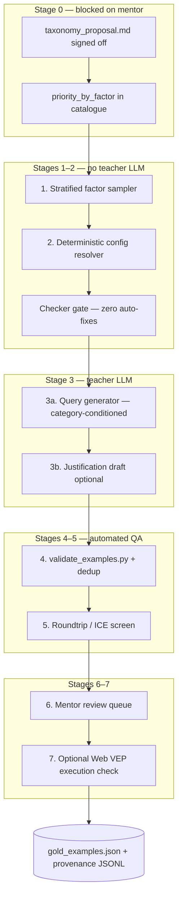

# Gold-example generation pipeline — literature-grounded proposal

Status: **implemented (2026-07-08).** The pipeline described below is now built and runnable end to end
(Stages 0–6; the optional Web-VEP execution check, Stage 7, is out of scope for now). A first run of 30
examples produces candidate `(query → config)` rows **balanced across the taxonomy** — at least 15 per
factor value, including the non-human, somatic, structural-variant and regulatory cases that are otherwise
under-represented — with 28/30 passing all deterministic safety checks and a mean in-context critical-recall
of ~82%; a separate 17-check verification suite passes. The generated rows are **provisional candidates for
review, not validated gold**: they use a first-pass priority table and still depend on mentor sign-off of
the factor taxonomy and per-option priorities in `taxonomy_proposal.md` before scaling. The design rationale
follows.

This document proposes a **reproducible in-repo pipeline** for generating `(user_query → VEP
web-form config)` gold examples — the direction Likhitha outlined (lock labels → generate queries
and configs → optional Web VEP runs → human review → size experiments). It is grounded in the
synthetic-data literature reviewed in June 2026 and mapped to code that already exists in this
project (`validate_examples.py`, `vep_assistant.check_and_fix_violations`, the 58-option catalogue).

---

## 1. Why not “ask a frontier model for the whole row”?

The current **simulated** 23-example set (`preliminary_examples/simulated_gold_examples.json`) is a
synthetic, checker-validated stand-in — balanced across the use cases, but not real expert configs (and
not hand-authored). A forward path — one strong LLM writes query + options +
justification in a single pass — repeats failures we already see in the mentor's first draft
(rare-disease skew, inconsistent option ids, no explicit disables). Tool-learning work shows the
same pattern at scale: ChatGPT-generated ToolBench rows have **parameter-alignment errors in
~48%** of training instances (Iskander et al., EMNLP 2024).

The literature converges on a different shape for **structured outputs**:

| Pattern | Source | Core idea |
|---------|--------|-----------|
| **Asymmetric / reverse generation** | SynthIE (Josifoski et al., EMNLP 2023); SynthIE-style IE (Shakeri et al., EMNLP 2020); Alberti et al. (ACL 2019) roundtrip QA | Sample or fix the **label Y** first; generate natural language **X** second. Forward Y\|X is hard; reverse X\|Y is easy and controllable. |
| **Constraint-first synthesis** | NeurIPS 2024 constraint-based math data; Crab constraint back-translation (ACL 2025) | Ground truth must pass **verifiable rules** before NL is written. |
| **Stratified diversity config** | DataMorgana (Filice et al., ACL 2025 Industry) | Diversity comes from an explicit **category grid + probabilities**, not from hoping the LLM varies phrasing. |
| **Intrinsic quality gates + ICE** | “Quality Matters” (Iskander et al., EMNLP 2024) | Six human-defined criteria for tool/API data; **In-Context Evaluation** measures whether one example actually helps the target model. Filtered 10K beats 73K unfiltered. |
| **Teacher ≠ student for ICL** | Larger Models' Paradox (Xu et al., ICLR 2025) | Bigger teacher (405B, GPT-4) is **not** always better for the student; compatibility matters. Applies to **query phrasing** the student reads, not to mentor-validated labels. |
| **Human calibration set** | ARES (Saad-Falcon et al., NAACL 2024) | Small (~150) human preference set calibrates automated judges; PPI for confidence intervals. |
| **Multi-label stratification** | Sechidis et al. (2011); used in `taxonomy_proposal.md` §6 | Size and split by **factor-value coverage**, not single category counts. |

**Design principle for Ask VEPai:** deterministic code + KB + checker **dispose** of labels;
a teacher LLM **proposes** only natural language (queries, draft justifications). That matches
the project's defense-in-depth architecture and Exp 6 (examples-dominant grounding).

---

## 2. Pipeline overview



**Mentor step mapping:**

| Mentor step | Pipeline stage |
|-------------|----------------|
| 1. Lock category labels | Stage 0 — factor taxonomy + `priority_by_factor` |
| 2. Generate queries + options (≥3/category) | Stages 1–3 (options from resolver, queries from LLM) |
| 3. Run Web VEP | Stage 7 — execution validation only |
| 4. Human review | Stage 6 |
| 5. Dataset size experiments | Existing harness (`run_example_sweep.py`, `run_parallel_eval.py`) on approved gold |

---

## 3. Stage 0 — Lock labels (prerequisite)

**Input:** signed-off `research/taxonomy_proposal.md` (five factors, multi-label).

**Output:**

1. `generation_config/factors.json` — allowed values per factor (unchanged from proposal).
2. `generation_config/priorities/` or an updated `vep_options_expanded.json` field
   `priority_by_factor` (replacing provisional `priority_by_use_case`).
3. `generation_config/query_axes.json` — DataMorgana-style **query diversity** categorisations
   (independent of biology factors); see §5.

**Literature:** DataMorgana shows that **question-side** diversity must be configured explicitly;
biology factors alone do not produce varied phrasing (Filice et al., 2025 — ablation: removing
question categorisations drops n-gram diversity toward “vanilla” single-prompt generation).

**Blocker:** I will not scale generation past a 3–5 row smoke test until priorities are mentor-approved.

---

## 4. Stage 1 — Stratified factor sampling

**Goal:** Choose *which* gold row to build next, balancing **per-factor-value coverage** (not
single-label categories).

**Method:**

1. Maintain a coverage table: count of approved examples per `(factor, value)` label.
2. Each new sample draws a **factor tuple**:
   - `species`, `origin`, `variant_size_class` — exactly one value each (data facts).
   - `region_focus`, `analysis_goal` — one or more values (intent, multi-select).
3. **Selection policy** (SynthIE-style coverage reweighting): prefer tuples that include the
   currently rarest factor value(s). Inverse-frequency reweighting every K samples, same spirit
   as Wiki-cIE's relation rebalancing (Josifoski et al., 2023, §3.2).
4. **Multi-label stratification** for holdout splits: `iterative_train_test_split` from
   scikit-multilearn when N ≥ 50 (Sechidis et al., 2011; `taxonomy_proposal.md` §6).

**Target sizes** (from taxonomy proposal):

| Tier | ≥ per factor value | ~total rows | Use |
|------|-------------------|-------------|-----|
| Minimum viable | 3 | 24–30 | Leave-one-out; directional holdout |
| Stable | 5–6 | ~50 | 80/20 multi-label holdout |
| Benchmark | 10 | 100+ | Per-factor metrics with confidence |

**Output:** `candidates/<uuid>.factor.json` — the tuple + coverage snapshot at generation time.

---

## 5. Stage 2 — Deterministic config resolver (reverse / asymmetric step)

**Goal:** Produce `recommended_options` from the factor tuple **without** a teacher LLM.

**Algorithm** (implements `taxonomy_proposal.md` §5):

```
for each option id in catalogue:
  if any hard factor marks not_applicable → disabled, skip
  else priority = max over active factor values (critical > recommended > optional)
  enable if priority in {critical, recommended}; optional toggles per policy below
apply depends_on / conflicts_with from catalogue
run check_and_fix_violations — FAIL row if any species strip, conflict fix, or dependency auto-add
```

**`optional` policy (needs mentor rule):** default **enable** all `critical` + `recommended`;
include a **small, logged subset** of `optional` enables per row for Disable-F1 signal (open
decision in review queue).

**Explicit disables:** For every option not enabled, emit `"enabled": false` with a short `note`
(closed-world scoring — mentor draft rows omitted this).

**Literature:**

- **SynthIE / SynthIE (EMNLP 2023):** control P(Y) by sampling structured labels before text.
- **SynthIE (Shakeri et al., 2020):** answer-first QA generation improves precision of (X,Y) pairs.
- **Constraint synthesis (NeurIPS 2024):** labels verified by code, not model confidence.

**Output:** `candidates/<uuid>.config.json` — partial example (no `user_query` yet).

**Reuse:** `work/preliminary_examples/validate_examples.py` logic — gold rows must pass with
**zero checker mutations** (same bar as `preliminary_examples/README.md`).

---

## 6. Stage 3 — Natural-language generation (teacher LLM)

**Goal:** Given a **fixed** config + factor tuple, generate `user_query` (and optionally
`justification`) that a human would plausibly ask.

### 6a. Query generation — DataMorgana-style conditioning

**Config file:** `generation_config/query_axes.json` — categorisations with `name`,
`description`, `probability` (Filice et al., 2025).

**Proposed axes** (orthogonal to biology factors):

| Categorisation | Example categories | Rationale |
|----------------|-------------------|-----------|
| `phrasing` | concise-natural / verbose-natural / short-search-query | DataMorgana Table 1 |
| `premise` | direct / with-premise | Species, assay, cohort stated in premise vs left implicit |
| `persona` | clinician / bioinformatician / student | User expertise (COVID-19 persona grid in DataMorgana) |
| `terminology` | field-standard / lay | “WES” vs “exome sequencing” |

**Procedure:**

1. Sample one category per categorisation (product of probabilities).
2. Prompt teacher with: factor tuple, enabled/disabled option summary (ids + plain names from KB),
   category descriptions, 1–2 **seed queries** from mentor draft or bootstrap set (few-shot).
3. Generate **k = 3** candidate queries; pick one passing filters (§7).

**Teacher model:** frontier model acceptable here (e.g. Claude Opus) — **NL only**. Not used for
option ids.

**Student compatibility (optional fraction):** paraphrase ~20% of approved queries with
`gemma4:26b` so ICL examples are not exclusively Opus register (Xu et al., 2025 — compatibility;
Exp 6 — examples-dominant behaviour).

### 6b. Justification draft

Teacher drafts `justification` prose from the same context. **Factual fields** (`cli_flag`,
`web_form_section`, priorities) always come from the catalogue at export time, not from the model.

### 6c. What we deliberately do *not* do

- **Evol-Instruct on configs** (WizardLM, ICLR 2024) — evolving structured 58-option sets creates
  conflict violations; evolve **queries only** if needed.
- **Forward (query → config) generation** as gold truth — only as a **roundtrip diagnostic** (§7).

---

## 7. Stage 4 — Automated intrinsic gates

### 7.1 Deterministic (must pass)

| Gate | Implementation | Literature analogue |
|------|----------------|---------------------|
| Valid option ids | ⊆ `vep_options_expanded.json` | Parameter alignment (Iskander et al., 2024) |
| Checker clean | `validate_examples.py` — 0 mutations | Constraint synthesis |
| Factor consistency | `infer_species(query)` matches tuple; somatic rows must not enable `filter_common` | Hard rules in taxonomy §3 |
| Dedup | Embedding cosine < 0.92 to any approved query; ROUGE-L < 0.7 vs same factor cell | Self-Instruct filtering (Wang et al., ACL 2023) |

### 7.2 LLM-as-judge (flag, not auto-accept)

Adapt ToolBench **intrinsic criteria** to our setting (Iskander et al., 2024, §4.1):

- **Specificity** — species, assay, variant type sufficiently stated for config inference.
- **Coherence** — single scenario, not unrelated requests bolted together.
- **Solvability** — query is a **configuration recommendation** scenario, not a how-to/troubleshooting
  ticket (scope per `HANDOFF.md` §11).

Prompt a strong model; **flag** failures for mentor review. Do not silently drop without logging.

---

## 8. Stage 5 — Roundtrip / ICE screen

**Motivation:** Correct (query, config) pairs can still be **unhelpful for ICL** — “Quality Matters”
shows intrinsic correctness and educational value diverge (ICE vs human correctness confusion
matrices, EMNLP 2024 §5).

**Procedure (ICE adapted):**

1. Hold out candidate row `e`.
2. Run `gemma4:26b` with all **other approved** examples in prompt (all-examples condition).
3. Score **priority-weighted critical recall** on `e` (reuse `evaluate.py` / `score_metrics.py`).
4. If critical recall = 0 and query is not intentionally minimal (`analysis_goal` =
   basic-consequence only), **flag** — query may be too vague or config misaligned with wording.

This is a **screen**, not automatic rejection — mentor adjudicates flagged rows.

**Literature:** ICE (Iskander et al., 2024); roundtrip consistency (Alberti et al., 2019) —
generate Q from (context, A); keep if A′ ≈ A.

---

## 9. Stage 6 — Human review

**Queue prioritisation:**

1. All rows in **minimum-viable** tier (N ≤ 30) — full mentor review.
2. Later tiers — review all **flagged** rows + 20% spot-check.

**Review UI (minimal v1):** JSON or CSV with columns: factor tuple, query, enabled list, disabled
list, checker log, ICE score, judge flags. Mentor actions: `approve` / `edit_query` /
`edit_config` / `reject` + comment.

**Calibration set:** first ~20 mentor-reviewed rows become the **human preference validation set**
for tuning judge prompts (ARES, NAACL 2024 — ~150 ideal; we start smaller).

**Provenance:** append-only `generation/provenance.jsonl` per row:

```json
{
  "id": "human_germline_somatic_sv_mouse_001",
  "factor_tuple": { "...": "..." },
  "query_axes": { "...": "..." },
  "teacher_model": "claude-opus-4-20250514",
  "teacher_seed": 42,
  "resolver_version": "2026-06-27",
  "kb_hash": "sha256:…",
  "checker_pass": true,
  "ice_critical_recall": 0.85,
  "review_status": "approved",
  "reviewer": "likhitha",
  "reviewed_at": "2026-06-…"
}
```

---

## 10. Stage 7 — Optional Web VEP execution check

**Scope:** Validates that the config **runs** and output looks sane — **not** gold definition.

1. Export approved config to Web VEP / REST input format.
2. Run on a **fixed panel** of 1–3 variants per factor cell (species-appropriate).
3. Store outputs under `generation/vep_runs/<id>/`.
4. Failures → mentor queue (misconfiguration vs VEP service issue).

This step is optional for **minimum-viable** gold; required before claiming end-to-end benchmark
quality.

---

## 11. Output schema (approved gold)

Same shape as `simulated_gold_examples.json`, extended:

```json
{
  "id": "…",
  "user_query": "…",
  "factor_labels": {
    "species": "human",
    "origin": "germline",
    "variant_size_class": "small",
    "region_focus": ["coding"],
    "analysis_goal": ["clinical_interpretation", "population_frequency"]
  },
  "use_case_category": null,
  "confidence": "high",
  "recommended_options": { },
  "justification": "…",
  "provenance_id": "uuid in provenance.jsonl",
  "review_status": "approved"
}
```

`use_case_category` deprecated once factor labels are live; kept nullable for harness migration.

**Env switch:** `VEP_EXAMPLES_FILE=work/generation/gold_examples.json` for eval harness.

---

## 12. Planned code layout (not yet implemented)

```
work/generation/
  README.md
  generation_config/
    factors.json
    query_axes.json
    priorities/          # or merged into catalogue
  sample_factors.py      # Stage 1
  resolve_config.py      # Stage 2
  generate_queries.py    # Stage 3
  filter_candidates.py   # Stages 4–5
  export_for_review.py   # Stage 6 CSV/JSON
  run_web_vep_check.py   # Stage 7 (optional)
  provenance.jsonl
  candidates/            # gitignored until approved
  gold_examples.json     # mentor-approved only
```

All scripts honour `VEP_OPTIONS_FILE` and log commands per `EXPERIMENTS.md` discipline.

---

## 13. Teacher vs student roles (explicit)

| Artifact | Who generates | Why |
|----------|---------------|-----|
| Factor tuple | Stratified sampler | Coverage control (SynthIE; DataMorgana) |
| `recommended_options` | Deterministic resolver + checker | Faithfulness; no LLM hallucinated ids |
| `user_query` | Teacher LLM (frontier OK) | Diversity (DataMorgana) |
| `justification` | Teacher draft; facts from KB | LONGFAITH-style source grounding for prose |
| ICL usefulness | Measured on **student** (`gemma4:26b`) | ICE; Larger Models' Paradox |
| Gold truth | Mentor-approved | ARES human calibration |

The simulated 20-example set remains **directional** until this pipeline produces mentor-validated
rows. Numbers on simulated gold are not a benchmark (`EXPERIMENTS.md` note).

---

## 14. What success looks like (evaluation)

After each tier:

1. `validate_examples.py` — **100% pass** on `gold_examples.json`.
2. `run_parallel_eval.py --runs 5` — compare to prior simulated baseline; append to `EXPERIMENTS.md`
   (one variable: corpus only).
3. Coverage report — every factor value ≥ tier threshold.
4. Attribution on `real_queries_biostars.json` — faithfulness should not collapse vs synthetic
   (Exp 6b precedent).

---

## 15. Open decisions (for mentor)

1. **`optional` options in gold** — enable all recommended-only, or explicit negative examples for
   plausible-but-wrong toggles?
2. **Query axes** — which personas/phrasings match Ensembl helpdesk traffic?
3. **Web VEP panel** — which variant fixtures per species?
4. **Legacy `use_case_category`** — drop after migration or keep as derived summary?

---

## References

1. Josifoski, M., Šakota, M., Peyrard, M., & West, R. (2023). Exploiting Asymmetry for Synthetic
   Training Data Generation: SynthIE. *EMNLP 2023.*
   https://aclanthology.org/2023.emnlp-main.96/

2. Iskander, S., Cohen, N., Karnin, Z., Shapira, O., & Tolmach, S. (2024). Quality Matters:
   Evaluating Synthetic Data for Tool-Using LLMs. *EMNLP 2024.*
   https://aclanthology.org/2024.emnlp-main.285/

3. Filice, S., Horowitz, G., Carmel, D., Karnin, Z., Lewin-Eytan, L., & Maarek, Y. (2025).
   Generating Diverse Q&A Benchmarks for RAG Evaluation with DataMorgana. *ACL 2025 Industry.*
   https://aclanthology.org/2025.acl-industry.33/

4. Xu, Z., Jiang, F., Niu, L., Lin, B. Y., & Poovendran, R. (2025). Stronger Models Are Not
   Always Stronger Teachers for Instruction Tuning. *ICLR 2025.*
   https://openreview.net/forum?id=9lHqiFIUJI

5. Alberti, C., Lee, K., Collins, M., & Re, J. (2019). Synthetic QA Corpora Generation with
   Roundtrip Consistency. *ACL 2019.*
   https://aclanthology.org/P19-1620/

6. Saad-Falcon, J., Khattab, O., Potts, C., & Zaharia, M. (2024). ARES: An Automated Evaluation
   Framework for Retrieval-Augmented Generation Systems. *NAACL 2024.*
   https://aclanthology.org/2024.naacl-long.20/

7. Shakeri, S., et al. (2020). End-to-End Synthetic Data Generation for Domain Adaptation of
   Question Answering Systems. *EMNLP 2020.*
   https://aclanthology.org/2020.emnlp-main.439/

8. Wang, Y., et al. (2023). Self-Instruct. *ACL 2023.*
   https://aclanthology.org/2023.acl-long.754/

9. Xu, C., et al. (2024). WizardLM: Evol-Instruct. *ICLR 2024.*
   https://arxiv.org/abs/2304.12244

10. Sechidis, K., Tsoumakas, G., & Vlahavas, I. (2011). On the Stratification of Multi-Label Data.
    *(basis for scikit-multilearn iterative_train_test_split)*

Internal: `research/taxonomy_proposal.md`, `preliminary_examples/README.md`, `HANDOFF.md` §10–12,
`EXPERIMENTS.md` (simulated gold caveat).
